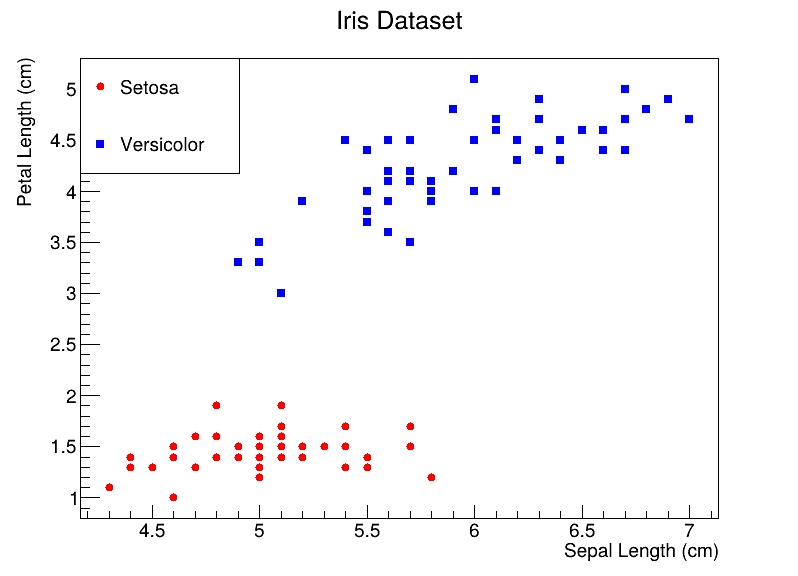
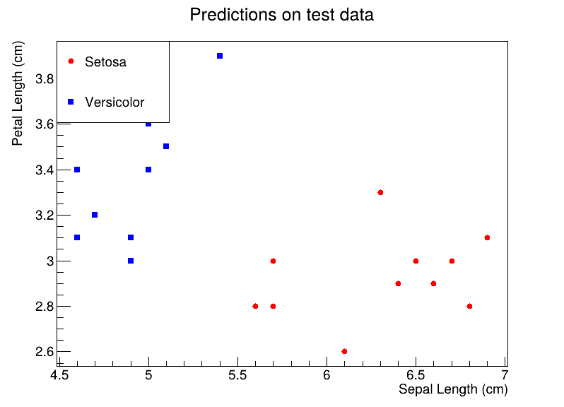

# Perceptron in C++

This code was mostly based on the book "Python Machine Learning: Machine Learning and Deep Learning with Python, scikit-learn, and TensorFlow 2", by Sebastian Raschka and Vahid Mirjalili.

#### Compile

---

g++ -std=c++2a -o run perceptron_iris.cpp \`root-config --cflags --libs\`

#### General

---

You will need C++17 (code uses #include <optional>).

Also, you will need the [root.cern](root.cern) framework if you want to create the plots.

The code uses just the sepal length and petal length, loaded in the `extractFeatures` function.

You can change the learning rate (LN) and epochs (EPOCHS) variables.

#### Results

---

Loaded Iris dataset

Predictions

